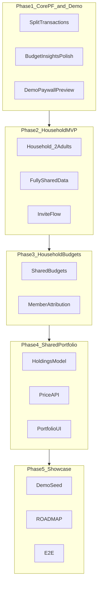
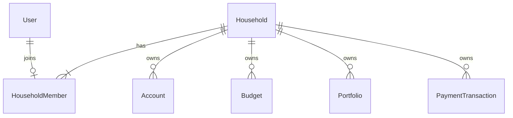

# FiscalNorth Product Roadmap

This document captures the planned direction for FiscalNorth as a **portfolio showcase project**: polish core personal finance features, then add household collaboration and a shared investment portfolio.

## Vision

| Decision | Choice |
|----------|--------|
| **Goal** | Portfolio / showcase project |
| **Top priority** | Core personal finance gaps (split transactions, insights, budgets) |
| **Must-have features** | Household budgets + shared portfolio |
| **Household size** | MVP: 2 adults (owner + member) |
| **Portfolio data** | Live price API with cached quotes |
| **Privacy model** | Fully shared — both members see all household data |
| **Premium demo** | Keep paywall visible; unlock features via "Try in demo" (no Stripe required) |

## Current state

FiscalNorth is a Spring Boot + Angular personal finance app with auth, transactions, CSV import, contracts, budgets, goals, dashboard, AI assistant, billing, and bank sync largely implemented.

**What works today**

- Single-user flows with per-user data isolation (`owner_id` on all entities)
- Premium gating via `EntitlementService` (backend) and paywall banners (frontend)
- Demo account: `alex@fiscalnorth.local` / `demo1234` (see [docs/AUTH.md](docs/AUTH.md))

**What is missing for this roadmap**

- Split transactions (advertised in README but not implemented)
- Household / multi-user model
- Shared budgets and portfolio tracking
- Demo-friendly premium preview mode

---

## Roadmap overview

---

## Phase 1 — Core personal finance + demo paywall

### 1.1 Split transactions

- Add `TransactionSplit` entity: `payment_id`, `amount`, `category_id`, optional `note`
- Validation: split lines must sum to parent `PaymentTransaction.amount`
- API: `GET/PUT /api/transaction/payment/{id}/splits` (or embed in create/update DTO)
- UI: toggle on transaction create/edit; show breakdown in list and insights

### 1.2 Budget & insights polish

- Dashboard budget progress bars with 80%/100% threshold styling
- Click category on dashboard → filtered transaction view for that month
- "Remaining" column on budget list (`limit - usage`)

### 1.3 Demo paywall preview

Keep the premium paywall visible (demonstrates monetization design) but allow demo visitors to access AI assistant, goal planner, bank sync UI, and AI notifications without Stripe.

| Layer | Change |
|-------|--------|
| **Config** | `app.demo.premium-preview-enabled=true` (default on for local/seed; off in production) |
| **Backend** | `EntitlementService`: grant premium features when preview mode is enabled |
| **Frontend** | Paywall banner keeps "Upgrade" CTA; add **"Try in demo"** button (session dismiss via localStorage) |
| **Premium routes** | Show banner as top strip instead of blocking entire UI |
| **Upgrade page** | When Stripe is disabled, show feature list with "Included in demo" badge |

**Demo flow**

1. Open `/assistant` → premium banner appears
2. Click **Try in demo** → banner collapses; assistant works (requires `GEMINI_API_KEY`)
3. `/account/upgrade` still shows pricing UI for showcase purposes

---

## Phase 2 — Household foundation (MVP)

### Scope

- One household per group; **max 2 members** (owner + partner)
- Roles: `OWNER` (creates household, sends invite), `MEMBER` (joins via invite)
- **Fully shared:** all accounts, budgets, transactions, goals, and portfolio are household-scoped — no private accounts or personal/household toggle

### Domain model

| Entity | Key fields |
|--------|------------|
| `Household` | `name`, `created_at` |
| `HouseholdMember` | `household_id`, `user_id`, `role`, `joined_at` |
| `HouseholdInvite` | `household_id`, `email`, `token`, `expires_at`, `status` |

### Migration

Add `household_id` FK to existing entities. Single-user data auto-migrates to a one-person household. Demo seed will include two users in one shared household.

### API (MVP)

- `POST /api/household` — create household
- `POST /api/household/invite` — invite partner by email
- `POST /api/household/invites/{token}/accept`
- `GET /api/household/me` — household + members
- Existing list endpoints filter by current user's `household_id`

### UI

- Onboarding: create household or accept invite after registration
- Settings → Household: view members, send invite

---

## Phase 3 — Household budgets

- All budgets are household-scoped
- Budget list shows combined usage plus **per-member breakdown** (who spent what)
- Dashboard KPI: "Household spent €X of €Y this month"
- Split transactions count toward budget by split category
- Budget alerts at 80%/100% notify both members

---

## Phase 4 — Shared portfolio + price API

### Holdings model

| Entity | Fields |
|--------|--------|
| `Portfolio` | `household_id`, `name`, `base_currency` |
| `Holding` | `portfolio_id`, `symbol`, `name`, `quantity`, `cost_basis`, `asset_class` |
| `PriceQuote` | `symbol`, `price`, `currency`, `fetched_at` (cache) |

### Price API

Integrate a free-tier provider ([Alpha Vantage](https://www.alphavantage.co/) or [Finnhub](https://finnhub.io/)):

- `app.portfolio.price-provider=alphavantage|finnhub|manual-fallback`
- `app.portfolio.price-api-key` environment variable
- Fetch on holding add/edit + daily refresh cron; cache in `PriceQuote`
- Fallback to last cached price with stale indicator when API is unavailable

### UI — `/portfolio`

- Total value, cost basis, unrealized gain/loss
- Asset allocation chart (by symbol or asset class)
- Holdings table with live prices
- Per-member audit on holding changes
- Dashboard widget: household net worth (accounts + portfolio)

---

## Phase 5 — Showcase polish

- [x] **ROADMAP.md** (this file)
- [ ] Demo seed: two users, shared household, budgets, split transactions, sample portfolio
- [ ] Cypress E2E: split transactions, demo paywall unlock, household invite, portfolio view
- [ ] README sync: Gemini (not Mistral), repo layout, demo credentials, portfolio API setup

---

## Sequenced backlog

| # | Item | Phase | Status |
|---|------|-------|--------|
| 1 | Split transactions | 1 | Planned |
| 2 | Budget & insights polish | 1 | Planned |
| 3 | Demo paywall preview | 1 | Planned |
| 4 | Household foundation (2 adults, fully shared) | 2 | Planned |
| 5 | Household budgets | 3 | Planned |
| 6 | Shared portfolio + price API | 4 | Planned |
| 7 | Demo seed + E2E tests | 5 | Planned |
| 8 | README / docs sync | 5 | Planned |

---

## Out of scope (for now)

- Stripe live checkout / production billing
- Private accounts within a household
- Viewer/child roles, households with 3+ members
- LLM PDF contract analysis
- Crypto accounts, Kafka, RabbitMQ, WebSocket
- XS2A production bank connections (bank sync UI accessible in demo preview)
- Tax reporting, multi-currency conversion
- Mobile native apps

---

## Related documentation

- [README.md](README.md) — project overview and setup
- [docs/AUTH.md](docs/AUTH.md) — authentication and demo login
- [docs/BILLING.md](docs/BILLING.md) — Stripe premium setup
- [docs/DEPLOY.md](docs/DEPLOY.md) — production deployment
