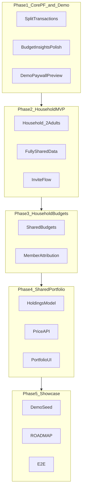

# FiscalNorth Product Roadmap

This document captures the planned direction for FiscalNorth as a **portfolio showcase project**: polish core personal finance features, then add household collaboration and a shared investment portfolio.

## Vision

| Decision | Choice |
|----------|--------|
| **Goal** | Portfolio / showcase project |
| **Top priority** | Core personal finance gaps (split transactions, insights, budgets) |
| **Must-have features** | Household budgets + shared portfolio |
| **Household size** | MVP: 2 adults (owner + member) |
| **Portfolio data** | Live price API with cached quotes |
| **Privacy model** | Fully shared — both members see all household data |
| **Premium demo** | Keep paywall visible; unlock features via "Try in demo" (no Stripe required) |

## Current state (Jul 2026)

**Implemented**

- Split transactions (API + UI, budget/insights aware)
- Demo paywall preview (`DEMO_PREMIUM_PREVIEW`, "Try in demo")
- Household MVP: 2 adults, fully shared data, invite + join flow
- Shared budgets with per-member attribution and remaining column
- Shared portfolio with Alpha Vantage + cached fallback, daily price cron
- Dashboard: net worth, household budget KPI, category drill-down
- Demo seed: Alex + Jamie, split transaction, portfolio holdings
- Cypress E2E for household, portfolio, splits, paywall unlock

**Demo accounts**

| User | Email | Password |
|------|-------|----------|
| Alex (owner) | `alex@fiscalnorth.local` | `demo1234` |
| Jamie (member) | `jamie@fiscalnorth.local` | `demo1234` |

---

## Roadmap overview

---

## Phase status

| Phase | Status | Notes |
|-------|--------|-------|
| 1 — Core PF + demo paywall | **Done** | Split tx, budget polish, demo preview |
| 2 — Household foundation | **Done** | 2 adults, fully shared, invite + join |
| 3 — Household budgets | **Done** | Member breakdown, household cron alerts |
| 4 — Shared portfolio | **Done** | Allocation chart, net-worth KPI, price cron |
| 5 — Showcase polish | **Done** | Demo seed, E2E, docs |

---

## Phase details (reference)

Phase 1 — Core personal finance + demo paywall

### 1.1 Split transactions

- `TransactionSplit` entity: `payment_id`, `amount`, `category_id`, optional `note`
- Validation: split lines must sum to parent `PaymentTransaction.amount`
- API: `GET/PUT /api/transaction/payment/{id}/splits`
- UI: toggle on transaction create/edit; show breakdown in list and insights

### 1.2 Budget & insights polish

- Dashboard budget progress bars with 80%/100% threshold styling
- Click category on dashboard → filtered transaction view for that month
- "Remaining" column on budget list (`limit - usage`)

### 1.3 Demo paywall preview

| Layer | Change |
|-------|--------|
| **Config** | `app.demo.premium-preview-enabled=true` (default on for local/seed) |
| **Backend** | `EntitlementService`: grant premium when preview mode enabled |
| **Frontend** | Paywall banner + **"Try in demo"** button (localStorage dismiss) |

Phase 2 — Household foundation (MVP)

- Max 2 members: `OWNER` + `MEMBER`, fully shared data
- API: `GET /api/household/me`, `POST /api/household/invite`, `POST /api/household/invites/accept?token=`
- UI: `/household` settings, `/household/join?token=…`

Phase 3 — Household budgets

- Household-scoped budgets with per-member breakdown
- Dashboard KPI: household spent vs limit
- Budget alerts at 80%/100% notify all premium members

Phase 4 — Shared portfolio + price API

- Holdings model: `Portfolio`, `Holding`, `PriceQuote`
- Alpha Vantage + cached fallback, daily refresh cron
- UI: `/portfolio` with allocation chart; dashboard net-worth widget

Phase 5 — Showcase polish

- [x] Demo seed (Alex + Jamie, splits, portfolio)
- [x] Cypress E2E
- [x] README / docs sync

---

## Sequenced backlog

| # | Item | Phase | Status |
|---|------|-------|--------|
| 1 | Split transactions | 1 | Done |
| 2 | Budget & insights polish | 1 | Done |
| 3 | Demo paywall preview | 1 | Done |
| 4 | Household foundation (2 adults, fully shared) | 2 | Done |
| 5 | Household budgets | 3 | Done |
| 6 | Shared portfolio + price API | 4 | Done |
| 7 | Demo seed + E2E tests | 5 | Done |
| 8 | README / docs sync | 5 | Done |

---

## Out of scope (for now)

- Stripe live checkout / production billing
- Private accounts within a household
- Viewer/child roles, households with 3+ members
- Email delivery for household invites (token shown in UI for demo)
- Tax reporting, multi-currency conversion
- Mobile native apps
- Production XS2A bank connections

---

## Related documentation

- [README.md](README.md) — project overview and setup
- [docs/AUTH.md](docs/AUTH.md) — authentication and demo login
- [docs/BILLING.md](docs/BILLING.md) — Stripe premium setup
- [docs/STAGING.md](docs/STAGING.md) — staging / demo preview checklist
- [docs/PLATFORM.md](docs/PLATFORM.md) — crypto, admin API, WebSocket
- [docs/DEPLOY.md](docs/DEPLOY.md) — production deployment
